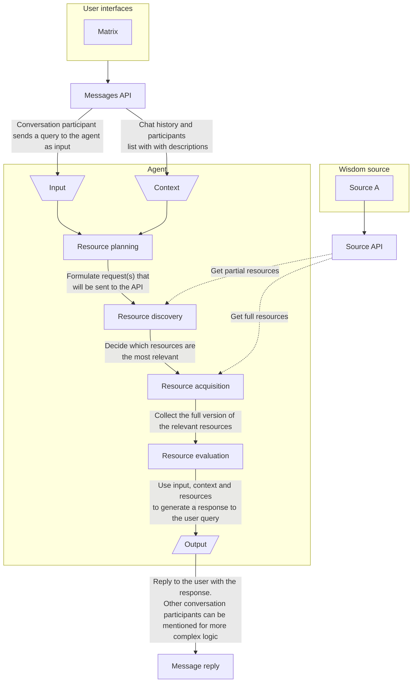

  

  <h3>Wisdom Allocation Large Language Engine</h3>

 

## What's WALL-e?

*WALL-e* is an advanced AI-driven system, primarily using GitHub as its knowledge base. It's designed to assist in various aspects of software development, from code analysis to project management.

## Agent architecture

